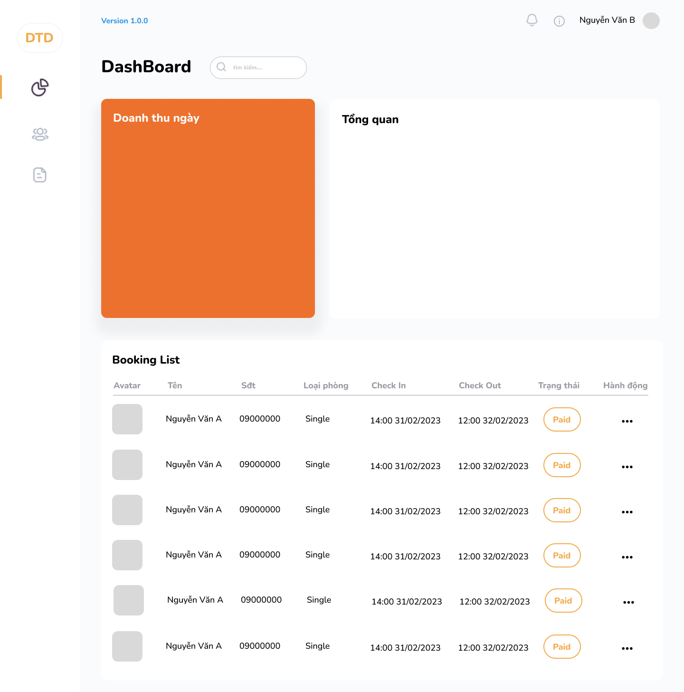

## Exercise Session 2

### Antd

### Requirement

- Sử dụng Antd để xây dụng UI 
- Cần chia component hợp lý và có thể re-use
- tạo state và props Type sao cho tối ưu và hợp lý

### Firebase

- Render dữ liệu lấy từ firestore

